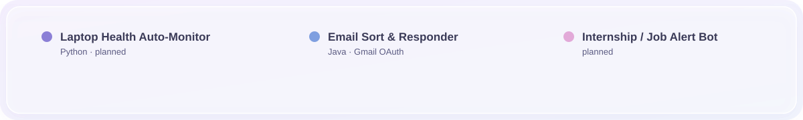
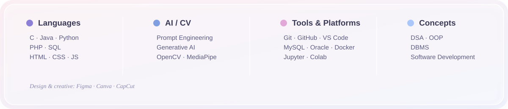

 

 

I'm **Ayush Singh** — a B.Tech Computer Engineering (AI) student focused on **Software Development, AI, and Data Analytics**.

Currently building projects, exploring emerging technologies, and continuously improving my development skills.

 

 

 

<table>
<tr>
<td width="50%" valign="top">

### ✋ Rock-Paper-Scissors vs AI
Real-time hand-gesture RPS — no keyboard, no mouse. Detects your hand sign live from webcam and decides the winner instantly.

`Python` `OpenCV` `MediaPipe`

</td>
<td width="50%" valign="top">

### 🔎 FindIt — Lost & Found
Campus Lost & Found platform for Ganpat University students to report and search for lost items.

`HTML` `CSS` `JavaScript` `PHP` `MySQL`

</td>
</tr>
<tr>
<td width="50%" valign="top">

### 🧩 Conversation Memory Manager
CLI tool exploring LLM memory strategies — full history, sliding window, summarization — with token-cost tracking. SQLite-backed, web UI planned.

`Python` `SQLite`

</td>
<td width="50%" valign="top">

### 🎮 Minimax Game AI
Browser-based game with an unbeatable AI opponent powered by the Minimax algorithm — visualizes decision-tree search, no GUI library.

`JavaScript` `HTML` `CSS`

</td>
</tr>
<tr>
<td width="50%" valign="top">

### 🔤 Mini Regex Engine
Regex engine built from scratch — concatenation, alternation, and Kleene star — no built-in regex libraries.

`Java`

[**View Repo →**](https://github.com/AyushSingh29-03/regex-engine-java)

</td>
<td width="50%" valign="top"></td>
</tr>
</table>

 

 

 

 

 

 

 

 

 

 

 

 

 

<!-- Proudly created with GPRM ( https://gprm.itsvg.in ) -->
